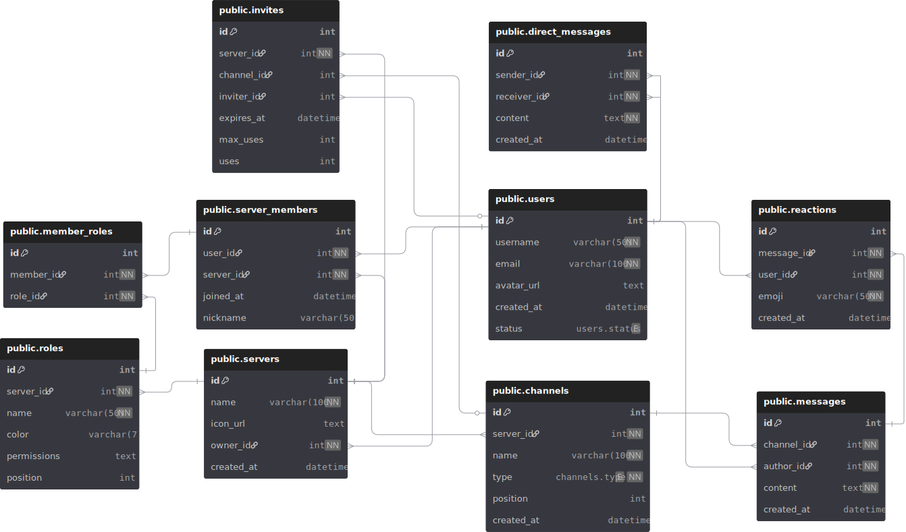

# Chat System

Účel databáze je uložit data pro chatovou platformu podobnou Discordu. Hlavní cíl je ukládání zpráv mezi uživateli nebo z kanálů na serverech, k tomu jsem ještě přidal navíc třeba reakce na zprávy, role na serveru a oprávnení uživatelů na serveru.

## Struktura
- Uživatelé (users)
  - Identita, e‑mail, avatar, status, čas vytvoření.
  - Unikátní uživatelské jméno a e‑mail.
- Servery (servers)
  - Vlastník, název, ikona, čas vytvoření.
- Členství na serveru (server_members)
  - Vazba uživatele na server, nickname, čas připojení.
- Role a přiřazení (roles, member_roles)
  - Role v rámci serveru s oprávněními a pořadím.
- Kanály (channels)
  - Patří k serveru, název, typ, pozice a čas vytvoření.
- Zprávy (messages) a soukromé zprávy (direct_messages)
  - Obsah, autor, kanál/účastník, čas vytvoření.
- Reakce (reactions)
  - Emoji reakce na zprávy s časovou značkou.
- Pozvánky (invites)
  - Vazba na server/kanál, pozývající, expirace, omezení počtu použití.

Odkaz na dbdiagram.io: [https://dbdiagram.io/d/chat-system-690316b26735e1117070ef8d](https://dbdiagram.io/d/chat-system-690316b26735e1117070ef8d)

